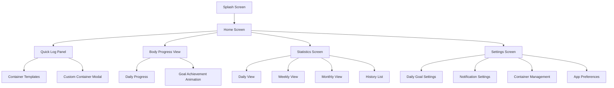

# WaterMinder Personal UI/UX Specification

This document defines the user experience goals, information architecture, user flows, and visual design specifications for **WaterMinder Personal**'s user interface. It serves as the foundation for visual design and frontend development, ensuring a cohesive and user-centered experience.

## Overall UX Goals & Principles

### Target User Personas

**Primary User: Personal Health Tracker**
- Individual seeking simple, visual hydration tracking
- Values immediate feedback and progress visualization  
- Prefers offline functionality without external dependencies
- Uses mobile device as primary interface for health tracking

### Usability Goals

- **Immediate gratification**: Visual feedback (body filling) happens instantly upon water logging
- **One-tap efficiency**: Core action (logging water) requires minimal interaction
- **Visual clarity**: Progress toward daily goal is immediately obvious
- **Habit reinforcement**: Design encourages consistent daily use through satisfying interactions

### Design Principles

1. **Visual feedback over data** - The body visualization is primary, numbers are secondary
2. **Simplicity over features** - Focus on core hydration tracking without complexity
3. **Immediate satisfaction** - Every action provides instant, delightful visual response
4. **Offline reliability** - All interactions work seamlessly without network dependency
5. **Mobile-first thinking** - Optimized for one-handed phone usage patterns

### Change Log

| Date | Version | Description | Author |
|------|---------|-------------|---------|
| 2025-08-05 | 1.0 | Initial UI/UX specification creation | UX Expert Sally |

## Information Architecture (IA)

### Site Map / Screen Inventory

### Navigation Structure

**Primary Navigation:** Tab-based bottom navigation con 3 secciones principales:
- **Home** (Progreso + Log rápido) - Screen principal con cuerpo visual
- **Stats** (Estadísticas) - Gráficos y métricas históricas  
- **Settings** (Configuración) - Objetivos, recordatorios y personalización

**Secondary Navigation:** Swipe horizontal dentro de Statistics para cambiar entre vistas (Día/Semana/Mes)

**Breadcrumb Strategy:** No necesario - navegación simple de máximo 2 niveles de profundidad con back buttons claros en modals